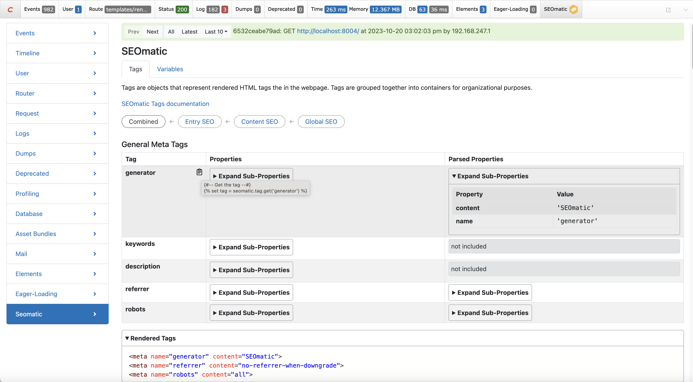
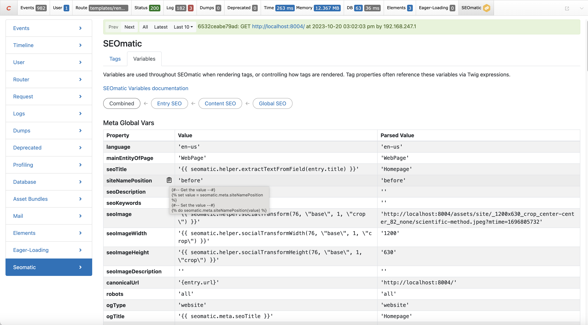
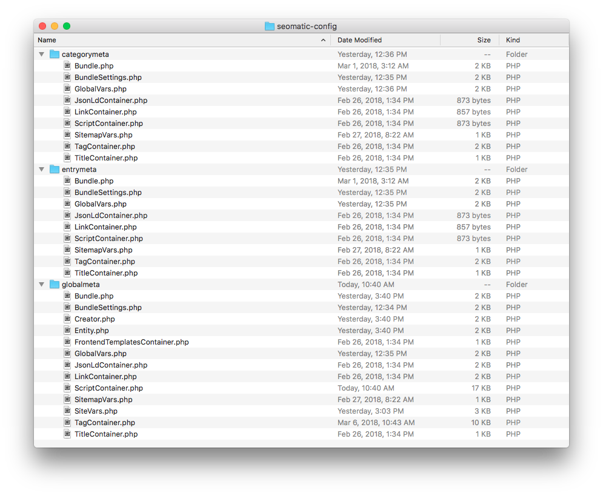
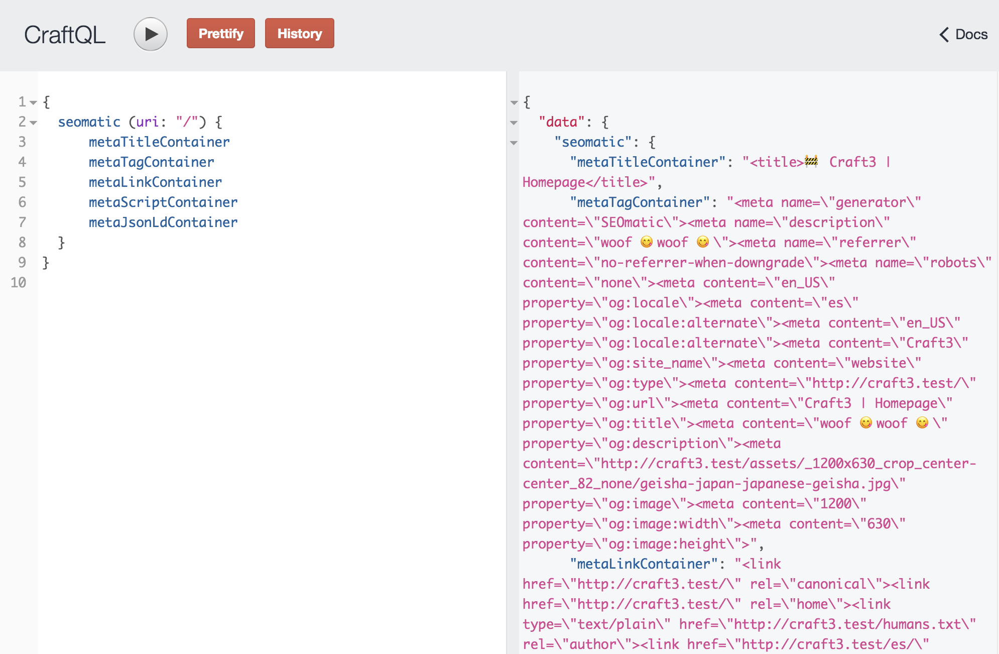

# Advanced Usage

Using the debug toolbar, managing config settings, events for PHP developers, bundle / container settings, and using the headless SPA API.

## Debug Toolbar

SEOmatic includes a debug panel for the [Yii2 Debug Toolbar](https://nystudio107.com/blog/profiling-your-website-with-craft-cms-3s-debug-toolbar) that allows you to inspect and debug your SEO data.


The debug panel displays debug information about the tags SEOmatic generates, as well as the variables it uses to do so.

You can view the **Combined** composed SEO data, or the discrete SEO data coming from the layered **Entry SEO**, **Content SEO**, and **Global SEO** settings.

The SEOmatic Debug Toolbar panel provides valuable debugging information if you have the Yii2 Debug Toolbar enabled, but it does add some overhead as well.

If you're doing performance profiling, you can keep the Yii2 Debug Toolbar enabled, but disable the SEOmatic panel via **Plugin Settings → Advanced → SEOmatic Debug Toolbar Panel**.

### Tags

Tags are objects that represent rendered HTML tags the in the webpage. Tags are grouped together into containers for organizational purposes.



You can inspect the **Properties** of the tags in each container, as well as the corresponding **Parsed Properties** after they have been rendered as Twig.

You can expand and sub-properties of nested properties by clicking on them.

You'll also see the rendered tags that SEOmatic has added to your webpage under **Rendered Tags**.

When hovering the cursor over any property, a clipboard icon will appear that when clicked on copies to the clipboard example code of how to get/set values for that particular property via Twig.

Tag example:
```twig
{# @var tag \nystudio107\seomatic\models\MetaTag #}

```

Tag property example:

```twig
{#-- Get the value --#}

{#-- Set the value --#}

```

### Variables

Variables are used throughout SEOmatic when rendering tags, or controlling how tags are rendered. Tag properties often reference these variables via Twig expressions.



You can inspect the **Properties** of the variables, as well as the corresponding **Parsed Properties** after they have been rendered as Twig.

You can expand and sub-properties of nested properties by clicking on them.

When hovering the cursor over any property, a clipboard icon will appear that when clicked on copies to the clipboard example code of how to get/set values for that particular property via Twig.

Variable example:

```twig
{#-- Get the value --#}

{#-- Set the value --#}

```

## Config Settings

SEOmatic supports the standard `config.php` multi-environment friendly config file for the plugin settings. Just copy the `config.php` to your Craft `config/` directory as `seomatic.php` and you can configure the settings in a multi-environment friendly way.

These are the same settings that are configured in the **Plugin Settings** in the control panel.

## Events

### IncludeContainerEvent

The event that is triggered when a container is about to be included.

```php
use nystudio107\seomatic\events\IncludeContainerEvent;
use nystudio107\seomatic\base\Container;
use yii\base\Event;

Event::on(
    Container::class,
    Container::EVENT_INCLUDE_CONTAINER,
    function(IncludeContainerEvent $event) {
        $event->include = false;
    }
);
```

### InvalidateContainerCachesEvent

The event that is triggered when SEOmatic is about to clear its meta container caches

```php
use nystudio107\seomatic\events\InvalidateContainerCachesEvent;
use nystudio107\seomatic\services\MetaContainers;
use yii\base\Event;

Event::on(
    MetaContainers::class,
    MetaContainers::EVENT_INVALIDATE_CONTAINER_CACHES,
    function(InvalidateContainerCachesEvent $event) {
        // Container caches are about to be cleared
    }
);
```

### IncludeSitemapEntryEvent

The event that is triggered when an entry is about to be included in a sitemap.

```php
use nystudio107\seomatic\events\IncludeSitemapEntryEvent;
use nystudio107\seomatic\helpers\Sitemap;
use yii\base\Event;

Event::on(
    Sitemap::class,
    Sitemap::EVENT_INCLUDE_SITEMAP_ENTRY,
    function(IncludeSitemapEntryEvent $event) {
        $event->include = false;
    }
);
```

### RegisterSitemapUrlsEvent

The event that is triggered when registering additional URLs for a sitemap.

```php
use nystudio107\seomatic\events\RegisterSitemapUrlsEvent;
use nystudio107\seomatic\models\SitemapCustomTemplate;
use yii\base\Event;

Event::on(
    SitemapCustomTemplate::class,
    SitemapCustomTemplate::EVENT_REGISTER_SITEMAP_URLS,
    function(RegisterSitemapUrlsEvent $event) {
        $event->sitemaps[] = [
            'loc' => $url,
            'changefreq' => $changeFreq,
            'priority' => $priority,
            'lastmod' => $lastMod,
        ];
    }
);
```

### RegisterSitemapsEvent

The event that is triggered when registering additional sitemaps for the sitemap index.

```php
use nystudio107\seomatic\events\RegisterSitemapsEvent;
use nystudio107\seomatic\models\SitemapIndexTemplate;
use yii\base\Event;

Event::on(
    SitemapIndexTemplate::class,
    SitemapIndexTemplate::EVENT_REGISTER_SITEMAPS,
    function(RegisterSitemapsEvent $event) {
        $event->sitemaps[] = [
            'loc' => $url,
            'lastmod' => $lastMod,
        ];
    }
);
```

### RegisterComponentTypesEvent

The event that is triggered when registering SeoElement types

SeoElement types must implement [[SeoElementInterface]]

```php
use nystudio107\seomatic\services\SeoElements;
use craft\events\RegisterComponentTypesEvent;
use yii\base\Event;

Event::on(
    SeoElements::class,
    SeoElements::EVENT_REGISTER_SEO_ELEMENT_TYPES,
    function(RegisterComponentTypesEvent $event) {
        $event->types[] = MySeoElement::class;
    }
);
```

### AddDynamicMetaEvent

The event that is triggered when SEOmatic has included the standard meta containers, and gives your plugin/module the chance to add whatever custom dynamic meta items you like

```php
use nystudio107\seomatic\events\AddDynamicMetaEvent;
use nystudio107\seomatic\helpers\DynamicMeta;
use yii\base\Event;
use nystudio107\seomatic\Seomatic;

Event::on(
    DynamicMeta::class,
    DynamicMeta::EVENT_ADD_DYNAMIC_META,
    function(AddDynamicMetaEvent $event) {
        // Add whatever dynamic meta items to the containers as you like
        Seomatic::$seomaticVariable
          ->meta
          ->seoDescription = "This description overrides any others!";
    }
);
```

## Meta Bundle / Container Settings

The [`vendor/nystudio107/seomatic/src/seomatic-config`](https://github.com/nystudio107/craft-seomatic/tree/develop-v5/src/seomatic-config) directory contains a number of files that are used when initially configuring SEOmatic.



You can copy this entire directory to your Craft `config/` directory, and customize the files to your heart’s content. SEOmatic will first look in the `config/` directory for any given file, and then fall back on its own internal `seomatic-config` files.

Note that these files are only used when initially creating a meta bundle. That is, whenever the plugin is installed, or new Section, Category Groups, or Commerce Product Types are created. Once meta bundles have been created, changing the settings in the file will have no effect.

You can bump the `Bundle.php`'s `bundleVersion` setting if you want it to re-read your config settings.

## Headless SPA API

SEOmatic allows you to fetch the meta information for any page via a controller API endpoint, so you can render the metadata via a front-end framework like VueJS or React.

### GraphQL Query support

To retrieve SEOmatic container data through [GraphQL in Craft CMS 5](https://craftcms.com/docs/5.x/development/graphql.html#sending-api-requests), use the `seomatic` field in your GraphQL query. Each parameter will return that container’s data, ready for insertion into the DOM.

#### Stand-alone GraphQL queries

You must as least pass in the URI you want metadata for:

```graphql
{
  seomatic (uri: "/") {
    metaTitleContainer
    metaTagContainer
    metaLinkContainer
    metaScriptContainer
    metaJsonLdContainer
    metaSiteVarsContainer
  }
}
```

...and you can also pass in an optional `siteId`:

```graphql
{
  seomatic (uri: "/", siteId: 2) {
    metaTitleContainer
    metaTagContainer
    metaLinkContainer
    metaScriptContainer
    metaJsonLdContainer
    metaSiteVarsContainer
  }
}
```

...or you can also pass in an optional `site` handle:

```graphql
{
  seomatic (uri: "/", site: "french") {
    metaTitleContainer
    metaTagContainer
    metaLinkContainer
    metaScriptContainer
    metaJsonLdContainer
    metaSiteVarsContainer
  }
}
```

...and you can also pass in an optional `asArray` parameter:

```graphql
{
  seomatic (uri: "/", asArray: true) {
    metaTitleContainer
    metaTagContainer
    metaLinkContainer
    metaScriptContainer
    metaJsonLdContainer
    metaSiteVarsContainer
  }
}
```
This defaults to `false` which returns to you HTML ready to be inserted into the DOM. If you set it to `true` then it will return a JSON-encoded array of the container data.

This is useful if you’re using Next.js, Nuxt.js, Gatsby, Gridsome, or anything else that uses a library to insert the various tags. In this case, you want the raw data to pass along.

...and you can also pass in an optional `environment` parameter:

```graphql
{
  seomatic (uri: "/", environment: staging) {
    metaTitleContainer
    metaTagContainer
    metaLinkContainer
    metaScriptContainer
    metaJsonLdContainer
    metaSiteVarsContainer
  }
}
```
This will override whatever the current SEOmatic environment is set to, and allow you to get the appropriate meta information for any of the preset SEOmatic environments. So `robots` for example will be disabled in `local` developmand & `staging` environments.

This is useful if you are using a single Craft CMS instance to render metadata for multiple environments like `staging` and `live` production.

Valid values are `local` for local development, `staging` for staging, and `live` for live production.



#### Piggybacking GraphQL queries

You can also piggyback on an entries query, to return all of your data for an entry as well as the SEOmatic metadata in one request.

Craft CMS GraphQL:

```graphql
{
  entry(section: "homepage") {
    id
    title
    seomatic {
      metaTitleContainer
      metaTagContainer
      metaLinkContainer
      metaScriptContainer
      metaJsonLdContainer
      metaSiteVarsContainer
    }
  }
}
```

In this case, no arguments are passed in, because the URI and siteId will be taken from the parent Entry element. But you can pass in the `asArray` argument too:

Craft CMS GraphQL:

```graphql
{
  entry(section: "homepage") {
    id
    title
    seomatic(asArray: true) {
      metaTitleContainer
      metaTagContainer
      metaLinkContainer
      metaScriptContainer
      metaJsonLdContainer
      metaSiteVarsContainer
    }
  }
}
```

### Frontend Templates GraphQL queries

SEOmatic an provide you with the front-end templates such as `robots.txt`, `humans.txt`, etc. as well:


```graphql
{
  seomatic {
    frontendTemplates {
      filename,
      contents
    }
  }
}
```

Arguments:

`frontendTemplates(siteId: 1, site: mainSite, type: robots)`

`siteId:` Int - Optional - The site ID to resolve the sitemap for.

`site:` String - Optional - The site handle to resolve the sitemap for.

`type:` String - The front-end container type, which can be `robots`, `humans`, `security`, or `ads`

#### Sitemap GraphQL queries

SEOmatic can provide you with the sitemap data via GraphQL as well.


SEOmatic allows you to query for `sitemapIndexes`:

```graphql
{
  seomatic {
    sitemapIndexes {
      filename
      contents
    }
  }
}
```

Arguments:

`sitemapIndexes(siteId: 1, site: mainSite)`

`siteId:` Int - Optional - The site ID to resolve the sitemap for.

`site:` String - Optional - The site handle to resolve the sitemap for.

SEOmatic allows you to query for `sitemaps`:

```graphql
{
  seomatic {
    sitemaps {
      filename
      contents
    }
  }
}
```

Arguments:

`sitemaps(filename: some_sitemap, siteId: 1, site: mainSite, sourceBundleType: product, sourceBundleHandle: someHandle)`

`filename:` String - Optional - the sitemap filename.

`siteId:` Int - Optional - The site ID to resolve the sitemap for.

`site:` String - Optional - The site handle to resolve the sitemap for.

`sourceBundleType:` String - Optional - The source bundle type to get the sitemaps for.

`sourceBundleHandle:` String - Optional - The source bundles handle to get the sitemap for.

SEOmatic also allows you to query for `sitemapStyles`:

```graphql
{
  seomatic {
    sitemapStyles {
      filename
      contents
    }
  }
}
```

This returns the [XSL stylesheet](https://www.w3.org/Style/XSL/WhatIsXSL.html) that SEOmatic uses to make the sitemaps pleasant for humans to read.

### Meta Container API Endpoints

::: tip
Anonymous access to the Meta Container endpoints are disabled by default; enable them in **SEOmatic** → **Plugin Settings** → **Endpoints**.
:::

To get all of the meta containers for a given URI, the controller action is:

```twig
/actions/seomatic/meta-container/all-meta-containers/?uri=/
```
...where `uri` is the path to obtain the meta information from.

This will return to you an array of meta containers, with the render-ready meta tags in each:

```json
{
    "MetaTitleContainer": "<title>[devMode] Craft3 | Homepage</title>",
    "MetaTagContainer": "<meta name=\"generator\" content=\"SEOmatic\"><meta name=\"referrer\" content=\"no-referrer-when-downgrade\"><meta name=\"robots\" content=\"all\">",
    "MetaLinkContainer": "<link href=\"http://craft3.test/\" rel=\"canonical\"><link type=\"text/plain\" href=\"/humans.txt\" rel=\"author\"><link href=\"http://craft3.test/\" rel=\"alternate\" hreflang=\"es\">",
    "MetaScriptContainer": "",
    "MetaJsonLdContainer": "<script type=\"application/ld+json\">{\"@context\":\"http://schema.org\",\"@type\":\"WebPage\",\"image\":{\"@type\":\"ImageObject\",\"height\":\"804\",\"width\":\"1200\"},\"inLanguage\":\"en-us\",\"mainEntityOfPage\":\"http://craft3.test/\",\"name\":\"Homepage\",\"url\":\"http://craft3.test/\"}</script><script type=\"application/ld+json\">{\"@context\":\"http://schema.org\",\"@type\":\"BreadcrumbList\",\"description\":\"Breadcrumbs list\",\"itemListElement\":[{\"@type\":\"ListItem\",\"item\":{\"@id\":\"http://craft3.test/\",\"name\":\"Homepage\"},\"position\":1}],\"name\":\"Breadcrumbs\"}</script>",
    "MetaSiteVarsContainer": "{\"siteName\":\"woof\",\"identity\":{\"siteType\":\"Organization\",\"siteSubType\":\"LocalBusiness\",\"siteSpecificType\":\"none\",\"computedType\":\"LocalBusiness\",\"genericName\":\"\",\"genericAlternateName\":\"\",\"genericDescription\":\"\",\"genericUrl\":\"$HOME\",\"genericImage\":null,\"genericImageWidth\":\"229\",\"genericImageHeight\":\"220\",\"genericImageIds\":[\"25\"],\"genericTelephone\":\"\",\"genericEmail\":\"\",\"genericStreetAddress\":\"\",\"genericAddressLocality\":\"\",\"genericAddressRegion\":\"\",\"genericPostalCode\":\"\",\"genericAddressCountry\":\"\",\"genericGeoLatitude\":\"\",\"genericGeoLongitude\":\"\",\"personGender\":\"Male\",\"personBirthPlace\":\"\",\"organizationDuns\":\"\",\"organizationFounder\":\"\",\"organizationFoundingDate\":\"\",\"organizationFoundingLocation\":\"\",\"organizationContactPoints\":\"\",\"corporationTickerSymbol\":\"\",\"localBusinessPriceRange\":\"$\",\"localBusinessOpeningHours\":[{\"open\":null,\"close\":null},{\"open\":null,\"close\":null},{\"open\":null,\"close\":null},{\"open\":null,\"close\":null},{\"open\":null,\"close\":null},{\"open\":null,\"close\":null},{\"open\":null,\"close\":null}],\"restaurantServesCuisine\":\"\",\"restaurantMenuUrl\":\"\",\"restaurantReservationsUrl\":\"\"},\"creator\":{\"siteType\":\"Organization\",\"siteSubType\":\"LocalBusiness\",\"siteSpecificType\":\"none\",\"computedType\":\"LocalBusiness\",\"genericName\":\"\",\"genericAlternateName\":\"\",\"genericDescription\":\"\",\"genericUrl\":\"\",\"genericImage\":null,\"genericImageWidth\":\"1340\",\"genericImageHeight\":\"596\",\"genericImageIds\":[\"24\"],\"genericTelephone\":\"\",\"genericEmail\":\"\",\"genericStreetAddress\":\"\",\"genericAddressLocality\":\"\",\"genericAddressRegion\":\"\",\"genericPostalCode\":\"\",\"genericAddressCountry\":\"\",\"genericGeoLatitude\":\"\",\"genericGeoLongitude\":\"\",\"personGender\":\"Male\",\"personBirthPlace\":\"\",\"organizationDuns\":\"\",\"organizationFounder\":\"\",\"organizationFoundingDate\":\"\",\"organizationFoundingLocation\":\"\",\"organizationContactPoints\":\"\",\"corporationTickerSymbol\":\"\",\"localBusinessPriceRange\":\"$\",\"localBusinessOpeningHours\":[{\"open\":null,\"close\":null},{\"open\":null,\"close\":null},{\"open\":null,\"close\":null},{\"open\":null,\"close\":null},{\"open\":null,\"close\":null},{\"open\":null,\"close\":null},{\"open\":null,\"close\":null}],\"restaurantServesCuisine\":\"\",\"restaurantMenuUrl\":\"\",\"restaurantReservationsUrl\":\"\"},\"twitterHandle\":\"\",\"facebookProfileId\":\"\",\"facebookAppId\":\"\",\"googleSiteVerification\":\"\",\"bingSiteVerification\":\"\",\"pinterestSiteVerification\":\"\",\"sameAsLinks\":{\"twitter\":{\"siteName\":\"Twitter\",\"handle\":\"twitter\",\"url\":\"\"},\"facebook\":{\"siteName\":\"Facebook\",\"handle\":\"facebook\",\"url\":\"\"},\"wikipedia\":{\"siteName\":\"Wikipedia\",\"handle\":\"wikipedia\",\"url\":\"\"},\"linkedin\":{\"siteName\":\"LinkedIn\",\"handle\":\"linkedin\",\"url\":\"\"},\"googleplus\":{\"siteName\":\"Google+\",\"handle\":\"googleplus\",\"url\":\"\"},\"youtube\":{\"siteName\":\"YouTube\",\"handle\":\"youtube\",\"url\":\"\"},\"instagram\":{\"siteName\":\"Instagram\",\"handle\":\"instagram\",\"url\":\"\"},\"pinterest\":{\"siteName\":\"Pinterest\",\"handle\":\"pinterest\",\"url\":\"\"},\"github\":{\"siteName\":\"GitHub\",\"handle\":\"github\",\"url\":\"\"},\"vimeo\":{\"siteName\":\"Vimeo\",\"handle\":\"vimeo\",\"url\":\"\"}},\"siteLinksSearchTarget\":\"\",\"siteLinksQueryInput\":\"\",\"referrer\":\"no-referrer-when-downgrade\",\"additionalSitemapUrls\":[],\"additionalSitemapUrlsDateUpdated\":null,\"additionalSitemaps\":[]}",
  "FrontendTemplateContainer": "[{\"humans\":\"/* TEAM */\\n\\nCreator: nystudio107\\nURL: https://nystudio107.com/\\nDescription: We do technology-based consulting, branding, design, and development. Making the web better one site at a time, with a focus on performance, usability & SEO\\n\\n/* THANKS */\\n\\nCraft CMS - https://craftcms.com\\nPixel & Tonic - https://pixelandtonic.com\\n\\n/* SITE */\\n\\nStandards: HTML5, CSS3\\nComponents: Craft CMS 3, Yii2, PHP, JavaScript, SEOmatic\\n\"},{\"robots\":\"# robots.txt for http://localhost:8000/\\n\\nsitemap: http://localhost:8000/sitemaps-1-sitemap.xml\\nsitemap: http://localhost:8000/es/sitemaps-1-sitemap.xml\\n\\n# local - disallow all\\n\\nUser-agent: *\\nDisallow: /\\n\\n\"},{\"ads\":\"# ads.txt file for http://localhost:8000/\\n# More info: https://support.google.com/admanager/answer/7441288?hl=en\\nhttp://localhost:8000/,123,DIRECT\\n\"}]"
}
```
To request a URI from a specific site in a multi-site setup, you can do that with the optional `siteId=SITE_ID` parameter:

```
/actions/seomatic/meta-container/all-meta-containers/?uri=/&siteId=2
```

Should you wish to have the items in the meta containers return as an array of data instead, you can do that with the optional `asArray=true` parameter:

```
/actions/seomatic/meta-container/all-meta-containers/?uri=/&asArray=true
```

Which will return the data in array form:

::: details Expand Result
```json
{
  "MetaTitleContainer": {
    "title": {
      "title": "[devMode] Craft3 | Homepage"
    }
  },
  "MetaTagContainer": {
    "generator": {
      "content": "SEOmatic",
      "name": "generator"
    },
    "referrer": {
      "content": "no-referrer-when-downgrade",
      "name": "referrer"
    },
    "robots": {
      "content": "all",
      "name": "robots"
    }
  },
  "MetaLinkContainer": {
    "canonical": {
      "href": "http://craft3.test/",
      "rel": "canonical"
    },
    "author": {
      "href": "/humans.txt",
      "rel": "author",
      "type": "text/plain"
    },
    "alternate": {
      "href": "http://craft3.test/",
      "hreflang": "es",
      "rel": "alternate"
    }
  },
  "MetaScriptContainer": [],
  "MetaJsonLdContainer": {
    "WebPage": {
      "@context": "http://schema.org",
      "@type": "WebPage",
      "image": {
        "@type": "ImageObject",
        "height": "804",
        "width": "1200"
      },
      "inLanguage": "en-us",
      "mainEntityOfPage": "http://craft3.test/",
      "name": "Homepage",
      "url": "http://craft3.test/"
    },
    "BreadcrumbList": {
      "@context": "http://schema.org",
      "@type": "BreadcrumbList",
      "description": "Breadcrumbs list",
      "itemListElement": [
        {
          "@type": "ListItem",
          "name": "Homepage",
          "item": "http://craft3.test/",
          "position": 1
        }
      ],
      "name": "Breadcrumbs"
    }
  },
  "MetaSiteVarsContainer": {
    "siteName": "woof",
    "identity": {
      "siteType": "Organization",
      "siteSubType": "LocalBusiness",
      "siteSpecificType": "none",
      "computedType": "LocalBusiness",
      "genericName": "",
      "genericAlternateName": "",
      "genericDescription": "",
      "genericUrl": "$HOME",
      "genericImage": null,
      "genericImageWidth": "229",
      "genericImageHeight": "220",
      "genericImageIds": [
        "25"
      ],
      "genericTelephone": "",
      "genericEmail": "",
      "genericStreetAddress": "",
      "genericAddressLocality": "",
      "genericAddressRegion": "",
      "genericPostalCode": "",
      "genericAddressCountry": "",
      "genericGeoLatitude": "",
      "genericGeoLongitude": "",
      "personGender": "Male",
      "personBirthPlace": "",
      "organizationDuns": "",
      "organizationFounder": "",
      "organizationFoundingDate": "",
      "organizationFoundingLocation": "",
      "organizationContactPoints": "",
      "corporationTickerSymbol": "",
      "localBusinessPriceRange": "$",
      "localBusinessOpeningHours": [
        {
          "open": null,
          "close": null
        },
        {
          "open": null,
          "close": null
        },
        {
          "open": null,
          "close": null
        },
        {
          "open": null,
          "close": null
        },
        {
          "open": null,
          "close": null
        },
        {
          "open": null,
          "close": null
        },
        {
          "open": null,
          "close": null
        }
      ],
      "restaurantServesCuisine": "",
      "restaurantMenuUrl": "",
      "restaurantReservationsUrl": ""
    },
    "creator": {
      "siteType": "Organization",
      "siteSubType": "LocalBusiness",
      "siteSpecificType": "none",
      "computedType": "LocalBusiness",
      "genericName": "",
      "genericAlternateName": "",
      "genericDescription": "",
      "genericUrl": "",
      "genericImage": null,
      "genericImageWidth": "1340",
      "genericImageHeight": "596",
      "genericImageIds": [
        "24"
      ],
      "genericTelephone": "",
      "genericEmail": "",
      "genericStreetAddress": "",
      "genericAddressLocality": "",
      "genericAddressRegion": "",
      "genericPostalCode": "",
      "genericAddressCountry": "",
      "genericGeoLatitude": "",
      "genericGeoLongitude": "",
      "personGender": "Male",
      "personBirthPlace": "",
      "organizationDuns": "",
      "organizationFounder": "",
      "organizationFoundingDate": "",
      "organizationFoundingLocation": "",
      "organizationContactPoints": "",
      "corporationTickerSymbol": "",
      "localBusinessPriceRange": "$",
      "localBusinessOpeningHours": [
        {
          "open": null,
          "close": null
        },
        {
          "open": null,
          "close": null
        },
        {
          "open": null,
          "close": null
        },
        {
          "open": null,
          "close": null
        },
        {
          "open": null,
          "close": null
        },
        {
          "open": null,
          "close": null
        },
        {
          "open": null,
          "close": null
        }
      ],
      "restaurantServesCuisine": "",
      "restaurantMenuUrl": "",
      "restaurantReservationsUrl": ""
    },
    "twitterHandle": "",
    "facebookProfileId": "",
    "facebookAppId": "",
    "googleSiteVerification": "",
    "bingSiteVerification": "",
    "pinterestSiteVerification": "",
    "sameAsLinks": {
      "twitter": {
        "siteName": "Twitter",
        "handle": "twitter",
        "url": ""
      },
      "facebook": {
        "siteName": "Facebook",
        "handle": "facebook",
        "url": ""
      },
      "wikipedia": {
        "siteName": "Wikipedia",
        "handle": "wikipedia",
        "url": ""
      },
      "linkedin": {
        "siteName": "LinkedIn",
        "handle": "linkedin",
        "url": ""
      },
      "googleplus": {
        "siteName": "Google+",
        "handle": "googleplus",
        "url": ""
      },
      "youtube": {
        "siteName": "YouTube",
        "handle": "youtube",
        "url": ""
      },
      "instagram": {
        "siteName": "Instagram",
        "handle": "instagram",
        "url": ""
      },
      "pinterest": {
        "siteName": "Pinterest",
        "handle": "pinterest",
        "url": ""
      },
      "github": {
        "siteName": "GitHub",
        "handle": "github",
        "url": ""
      },
      "vimeo": {
        "siteName": "Vimeo",
        "handle": "vimeo",
        "url": ""
      }
    },
    "siteLinksSearchTarget": "",
    "siteLinksQueryInput": "",
    "referrer": "no-referrer-when-downgrade",
    "additionalSitemapUrls": [],
    "additionalSitemapUrlsDateUpdated": null,
    "additionalSitemaps": []
  },
  "FrontendTemplateContainer": [
    {
      "humans": "/* TEAM */\n\nCreator: nystudio107\nURL: https://nystudio107.com/\nDescription: We do technology-based consulting, branding, design, and development. Making the web better one site at a time, with a focus on performance, usability & SEO\n\n/* THANKS */\n\nCraft CMS - https://craftcms.com\nPixel & Tonic - https://pixelandtonic.com\n\n/* SITE */\n\nStandards: HTML5, CSS3\nComponents: Craft CMS 3, Yii2, PHP, JavaScript, SEOmatic\n"
    },
    {
      "robots": "# robots.txt for http://localhost:8000/\n\nsitemap: http://localhost:8000/sitemaps-1-sitemap.xml\nsitemap: http://localhost:8000/es/sitemaps-1-sitemap.xml\n\n# local - disallow all\n\nUser-agent: *\nDisallow: /\n\n"
    },
    {
      "ads": "# ads.txt file for http://localhost:8000/\n# More info: https://support.google.com/admanager/answer/7441288?hl=en\nhttp://localhost:8000/,123,DIRECT\n"
    }
  ]
}
```
:::

You can also request individual meta containers.

Title container:

```
/actions/seomatic/meta-container/meta-title-container/?uri=/
```

...will return just the Title container:

```json
{
  "MetaTitleContainer": "<title>[devMode] Craft3 | Homepage</title>"
}
```

Tag container:

```
/actions/seomatic/meta-container/meta-tag-container/?uri=/
```

...will return just the Tag container:

```json
{
  "MetaTagContainer": "<meta name=\"generator\" content=\"SEOmatic\"><meta name=\"referrer\" content=\"no-referrer-when-downgrade\"><meta name=\"robots\" content=\"all\">"
}
```

Script container:

```
/actions/seomatic/meta-container/meta-script-container/?uri=/
```

...will return just the Script container:
```json
{
  "MetaScriptContainer": ""
}
```

Link container:

```
/actions/seomatic/meta-container/meta-link-container/?uri=/
```

...will return just the Link container:

```json
{
  "MetaLinkContainer": "<link href=\"http://craft3.test/\" rel=\"canonical\"><link type=\"text/plain\" href=\"/humans.txt\" rel=\"author\"><link href=\"http://craft3.test/\" rel=\"alternate\" hreflang=\"es\">"
}
```

JSON-LD container:

```
/actions/seomatic/meta-container/meta-json-ld-container/?uri=/
```

...will return just the JSON-LD container:
```json
{
  "MetaJsonLdContainer": "<script type=\"application/ld+json\">{\"@context\":\"http://schema.org\",\"@type\":\"WebPage\",\"image\":{\"@type\":\"ImageObject\",\"height\":\"804\",\"width\":\"1200\"},\"inLanguage\":\"en-us\",\"mainEntityOfPage\":\"http://craft3.test/\",\"name\":\"Homepage\",\"url\":\"http://craft3.test/\"}</script><script type=\"application/ld+json\">{\"@context\":\"http://schema.org\",\"@type\":\"BreadcrumbList\",\"description\":\"Breadcrumbs list\",\"itemListElement\":[{\"@type\":\"ListItem\",\"item\":{\"@id\":\"http://craft3.test/\",\"name\":\"Homepage\"},\"position\":1}],\"name\":\"Breadcrumbs\"}</script>"
}
```

SiteVars container:

```
/actions/seomatic/meta-container/meta-site-vars-container/?uri=/
```

...will return just the MetaSiteVars container:
```json
{
  "MetaSiteVarsContainer": "{\"siteName\":\"woof\",\"identity\":{\"siteType\":\"Organization\",\"siteSubType\":\"LocalBusiness\",\"siteSpecificType\":\"none\",\"computedType\":\"LocalBusiness\",\"genericName\":\"\",\"genericAlternateName\":\"\",\"genericDescription\":\"\",\"genericUrl\":\"$HOME\",\"genericImage\":null,\"genericImageWidth\":\"229\",\"genericImageHeight\":\"220\",\"genericImageIds\":[\"25\"],\"genericTelephone\":\"\",\"genericEmail\":\"\",\"genericStreetAddress\":\"\",\"genericAddressLocality\":\"\",\"genericAddressRegion\":\"\",\"genericPostalCode\":\"\",\"genericAddressCountry\":\"\",\"genericGeoLatitude\":\"\",\"genericGeoLongitude\":\"\",\"personGender\":\"Male\",\"personBirthPlace\":\"\",\"organizationDuns\":\"\",\"organizationFounder\":\"\",\"organizationFoundingDate\":\"\",\"organizationFoundingLocation\":\"\",\"organizationContactPoints\":\"\",\"corporationTickerSymbol\":\"\",\"localBusinessPriceRange\":\"$\",\"localBusinessOpeningHours\":[{\"open\":null,\"close\":null},{\"open\":null,\"close\":null},{\"open\":null,\"close\":null},{\"open\":null,\"close\":null},{\"open\":null,\"close\":null},{\"open\":null,\"close\":null},{\"open\":null,\"close\":null}],\"restaurantServesCuisine\":\"\",\"restaurantMenuUrl\":\"\",\"restaurantReservationsUrl\":\"\"},\"creator\":{\"siteType\":\"Organization\",\"siteSubType\":\"LocalBusiness\",\"siteSpecificType\":\"none\",\"computedType\":\"LocalBusiness\",\"genericName\":\"\",\"genericAlternateName\":\"\",\"genericDescription\":\"\",\"genericUrl\":\"\",\"genericImage\":null,\"genericImageWidth\":\"1340\",\"genericImageHeight\":\"596\",\"genericImageIds\":[\"24\"],\"genericTelephone\":\"\",\"genericEmail\":\"\",\"genericStreetAddress\":\"\",\"genericAddressLocality\":\"\",\"genericAddressRegion\":\"\",\"genericPostalCode\":\"\",\"genericAddressCountry\":\"\",\"genericGeoLatitude\":\"\",\"genericGeoLongitude\":\"\",\"personGender\":\"Male\",\"personBirthPlace\":\"\",\"organizationDuns\":\"\",\"organizationFounder\":\"\",\"organizationFoundingDate\":\"\",\"organizationFoundingLocation\":\"\",\"organizationContactPoints\":\"\",\"corporationTickerSymbol\":\"\",\"localBusinessPriceRange\":\"$\",\"localBusinessOpeningHours\":[{\"open\":null,\"close\":null},{\"open\":null,\"close\":null},{\"open\":null,\"close\":null},{\"open\":null,\"close\":null},{\"open\":null,\"close\":null},{\"open\":null,\"close\":null},{\"open\":null,\"close\":null}],\"restaurantServesCuisine\":\"\",\"restaurantMenuUrl\":\"\",\"restaurantReservationsUrl\":\"\"},\"twitterHandle\":\"\",\"facebookProfileId\":\"\",\"facebookAppId\":\"\",\"googleSiteVerification\":\"\",\"bingSiteVerification\":\"\",\"pinterestSiteVerification\":\"\",\"sameAsLinks\":{\"twitter\":{\"siteName\":\"Twitter\",\"handle\":\"twitter\",\"url\":\"\"},\"facebook\":{\"siteName\":\"Facebook\",\"handle\":\"facebook\",\"url\":\"\"},\"wikipedia\":{\"siteName\":\"Wikipedia\",\"handle\":\"wikipedia\",\"url\":\"\"},\"linkedin\":{\"siteName\":\"LinkedIn\",\"handle\":\"linkedin\",\"url\":\"\"},\"googleplus\":{\"siteName\":\"Google+\",\"handle\":\"googleplus\",\"url\":\"\"},\"youtube\":{\"siteName\":\"YouTube\",\"handle\":\"youtube\",\"url\":\"\"},\"instagram\":{\"siteName\":\"Instagram\",\"handle\":\"instagram\",\"url\":\"\"},\"pinterest\":{\"siteName\":\"Pinterest\",\"handle\":\"pinterest\",\"url\":\"\"},\"github\":{\"siteName\":\"GitHub\",\"handle\":\"github\",\"url\":\"\"},\"vimeo\":{\"siteName\":\"Vimeo\",\"handle\":\"vimeo\",\"url\":\"\"}},\"siteLinksSearchTarget\":\"\",\"siteLinksQueryInput\":\"\",\"referrer\":\"no-referrer-when-downgrade\",\"additionalSitemapUrls\":[],\"additionalSitemapUrlsDateUpdated\":null,\"additionalSitemaps\":[]}"
}
```

Frontend Templates container:

```
/actions/seomatic/meta-container/frontend-template-container/?uri=/
```

...will return just the Frontend Templates container:

```json
{
  "FrontendTemplateContainer": "[{\"humans\":\"/* TEAM */\\n\\nCreator: nystudio107\\nURL: https://nystudio107.com/\\nDescription: We do technology-based consulting, branding, design, and development. Making the web better one site at a time, with a focus on performance, usability & SEO\\n\\n/* THANKS */\\n\\nCraft CMS - https://craftcms.com\\nPixel & Tonic - https://pixelandtonic.com\\n\\n/* SITE */\\n\\nStandards: HTML5, CSS3\\nComponents: Craft CMS 3, Yii2, PHP, JavaScript, SEOmatic\\n\"},{\"robots\":\"# robots.txt for http://localhost:8000/\\n\\nsitemap: http://localhost:8000/sitemaps-1-sitemap.xml\\nsitemap: http://localhost:8000/es/sitemaps-1-sitemap.xml\\n\\n# local - disallow all\\n\\nUser-agent: *\\nDisallow: /\\n\\n\"},{\"ads\":\"# ads.txt file for http://localhost:8000/\\n# More info: https://support.google.com/admanager/answer/7441288?hl=en\\nhttp://localhost:8000/,123,DIRECT\\n\"}]"
}
```

All of the individual container controller API endpoints also accept the `&asArray=true` parameter if you’d like the data in array form.

### Schema.org API Endpoints

::: tip
Anonymous access to the Schema.org JSON-LD endpoints are disabled by default; enable them in **SEOmatic** → **Plugin Settings** → **Endpoints**.
:::

To get a key-value array of a given [Schema.org](http://schema.org/docs/full.html) type:

```
/actions/seomatic/json-ld/get-type?schemaType=Article
```

To get a decomposed version of a given [Schema.org](http://schema.org/docs/full.html) type, with the properties grouped by each inherited type:

```
/actions/seomatic/json-ld/get-decomposed-type?schemaType=Article
```

To get a hierarchical array of all of the schema types: 

```
/actions/seomatic/json-ld/get-type-array?path=Article
```

You can narrow this down to a specific sub-type list by passing in a `path` of schema types delimited by a `.`:
```
/actions/seomatic/json-ld/get-type-array?path=CreativeWork.Article
```
...this would output all of the sub-types of `Article`:

```json
{
  "AdvertiserContentArticle": "AdvertiserContentArticle",
  "NewsArticle": {
    "AnalysisNewsArticle": "AnalysisNewsArticle",
    "BackgroundNewsArticle": "BackgroundNewsArticle",
    "OpinionNewsArticle": "OpinionNewsArticle",
    "ReportageNewsArticle": "ReportageNewsArticle",
    "ReviewNewsArticle": "ReviewNewsArticle"
  },
  "Report": "Report",
  "SatiricalArticle": "SatiricalArticle",
  "ScholarlyArticle": {
    "MedicalScholarlyArticle": "MedicalScholarlyArticle"
  },
  "SocialMediaPosting": {
    "BlogPosting": {
      "LiveBlogPosting": "LiveBlogPosting"
    },
    "DiscussionForumPosting": "DiscussionForumPosting"
  },
  "TechArticle": {
    "APIReference": "APIReference"
  }
}
```
