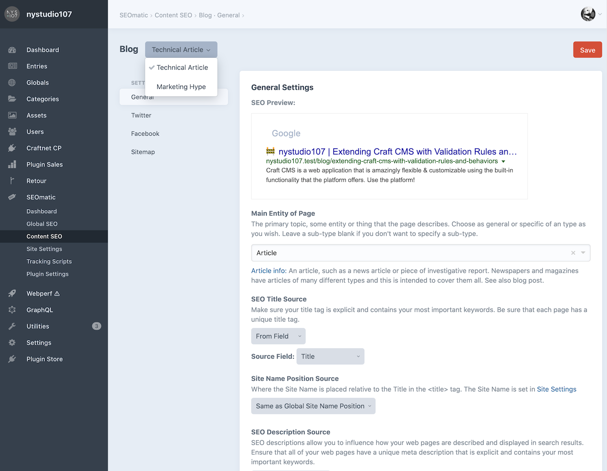
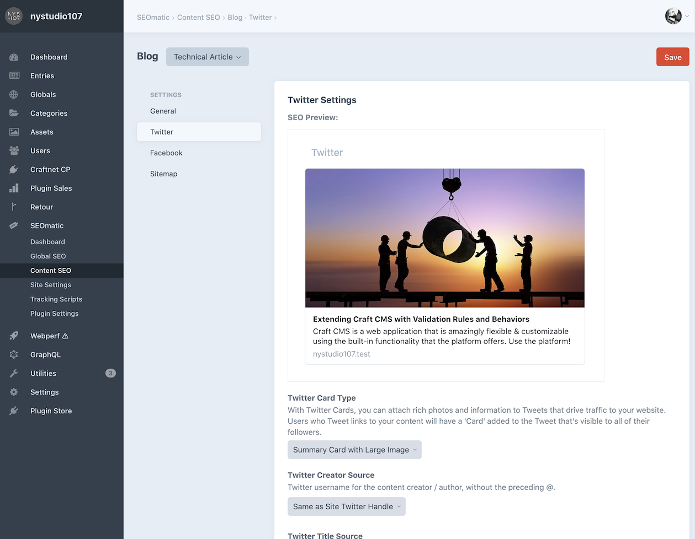
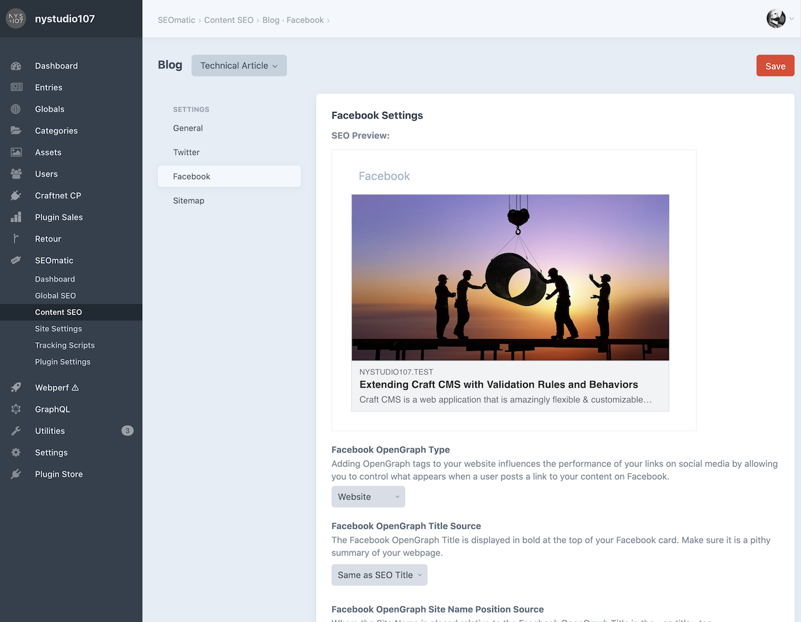
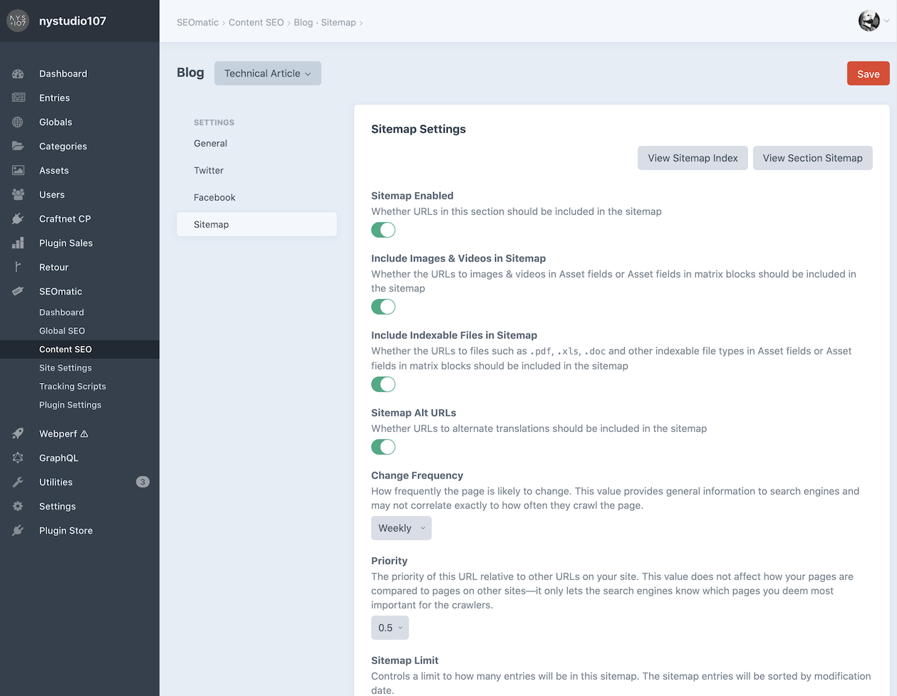

# Content SEO

Content SEO is where you can configure each Section, Category Group and Commerce Product Type that has public URLs.

A list of these content types includes status indicators identifying what’s been configured for each one:


SEOmatic allows you to have different Content SEO settings on both a per-site and per-[Entry Type](https://craftcms.com/docs/5.x/reference/element-types/entries.html#entry-types) basis.

Click the name of any listed item to edit its settings.

::: tip Settings are unique for each type!
Unlike the previous [Global SEO](./global-seo.md) section, the settings below each correspond with a specific Content SEO section or entry type you’ve chosen.
:::

## General Settings



This is where you can set up the fields from which SEOmatic extracts the **SEO Title**, **SEO Description**, and **SEO Image**. These per-section Content SEO settings, when they have values, will override the Global SEO general settings.

## Twitter Settings



By default, Twitter settings will mirror what you set in the **General** section, but you can customize them to your heart’s content.

## Facebook Settings



Facebook settings will also mirror what you set in the **General** section, but you can customize them here.

## Sitemap Settings



SEOmatic automatically creates a sitemap index for each of your Site Groups. This sitemap index points to individual sitemaps for each of your Sections, Category Groups, and Commerce Product Types.

Instead of one massive sitemap that must be updated any time anything changes, only the sitemap for the Section, Category Group, or Commerce Product Type will be updated when something changes in it.

Additionally, sitemaps are paginated according to the **Sitemap Page Size** setting (which defaults to `500` per page), to allow for a large number of entries in the sitemaps without hurting performance.

SEOmatic can automatically include files such as `.pdf`, `.xls`, `.doc` and other indexable file types in Asset fields or Asset fields in matrix or Neo blocks.

In addition, SEOmatic can automatically create [Image sitemaps](https://support.google.com/webmasters/answer/178636?hl=en) and [Video sitemaps](https://developers.google.com/webmasters/videosearch/sitemaps) from images & videos in Asset fields or Asset fields in matrix or Neo blocks.

Search engines no longer accept [sitemap pings](https://developers.google.com/search/blog/2023/06/sitemaps-lastmod-ping) for content updates, but rather will re-crawl your sitemaps on a regular basis to find new pages.

### Sitemap Generation

SEOmatic generates sitemaps on demand when requested on the frontend, and then caches the sitemap for future requests so they are fast.

Normally SEOmatic will invalidate the cache for a sitemap for a Section, Category Group, or Product any time you save an element. However,  if you prefer to invalidate the sitemap caches manually you can disable the **Invalidate Sitemap Caches Automatically** option in SEOmatic’s Plugin Settings.


You can then regenerate the sitemap via CLI. This will regenerate all sitemaps:

```bash
./craft seomatic/sitemap/generate
```

You can also limit it to a specific Section, Category Group, or Product handle:

```bash
./craft seomatic/sitemap/generate --handle=blog
```

...or you can regenerate all sitemaps for a specific `siteId`:

```bash
./craft seomatic/sitemap/generate --siteId=1
```

...or both:

```bash
./craft seomatic/sitemap/generate --handle=blog --siteId=1
```

::: tip Manually Updating Sitemaps
If you disable **Invalidate Sitemap Caches Automatically**, sitemaps can _only_ be updated via CLI command, or by clearing SEOmatic’s sitemap caches via **Utilities** → **Clear Caches**.
:::

### Additional Sitemaps

If you have custom sitemaps that are not in the CMS, you can manually add them to their own Sitemap Index via **Site Settings** → **Sitemap**.

You can also add to it via plugin:

```php
use nystudio107\seomatic\events\RegisterSitemapsEvent;
use nystudio107\seomatic\models\SitemapIndexTemplate;
use yii\base\Event;

Event::on(
    SitemapIndexTemplate::class,
    SitemapIndexTemplate::EVENT_REGISTER_SITEMAPS,
    function(RegisterSitemapsEvent $event) {
        $event->sitemaps[] = [
            'loc' => $url,
            'lastmod' => $lastMod,
        ];
    }
);
```

### Additional Sitemap URLs

If you have custom URLs that are not in the CMS, you can manually add them to their own Sitemap Index via **Site Settings** → **Sitemap**.

You can also add to it via a plugin:

```php
use nystudio107\seomatic\events\RegisterSitemapUrlsEvent;
use nystudio107\seomatic\models\SitemapCustomTemplate;
use yii\base\Event;

Event::on(
    SitemapCustomTemplate::class,
    SitemapCustomTemplate::EVENT_REGISTER_SITEMAP_URLS,
    function(RegisterSitemapUrlsEvent $event) {
        $event->sitemaps[] = [
            'loc' => $url,
            'changefreq' => $changeFreq,
            'priority' => $priority,
            'lastmod' => $lastMod,
        ];
    }
);
```
