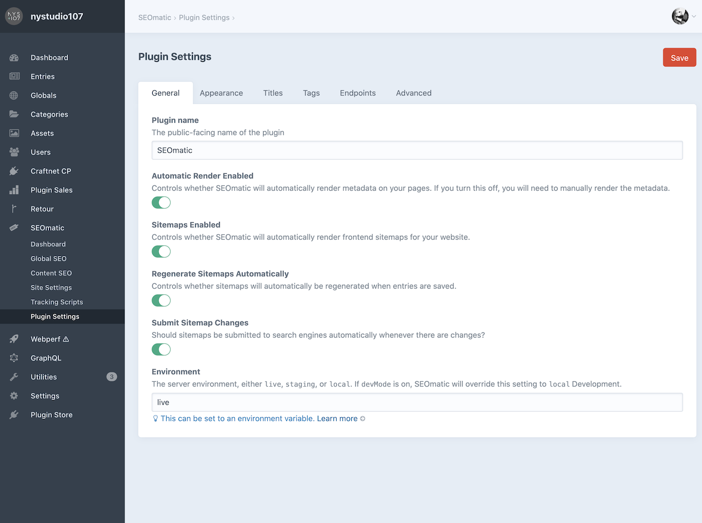

# Plugin Settings

Plugin Settings let you control various SEOmatic settings across all sites/languages.

## General Plugin Settings

* **Plugin name** – The name used for the plugin throughout the control panel.
* **Automatic Render Enabled** – Controls whether SEOmatic automatically renders metadata on your pages. If you turn this off, you will need to manually render the metadata via `seomatic.tag.render()`, `seomatic.link.render()`, etc. Selectively disable rendering via Twig with ``.
* **Sitemaps Enabled** – Controls whether SEOmatic will automatically render front-end sitemaps for your site.
* **Invalidate Sitemap Caches Automatically** – Controls whether sitemap caches will automatically be invalidated when entries are saved.
* **Include Homepage in Breadcrumbs** – Should the homepage be included in the generated Breadcrumbs JSON-LD?
* **Manually Set SEOmatic Environment** – If off, SEOmatic will automatically attempt to determine the current environment. Turn this on to manually set the environment.
* **Environment** – The server environment, either `live`, `staging`, or `local`. If `devMode` is on, SEOmatic will override this setting to local Development. This setting controls whether certain things render; for instance only in the `live` production environment will Google Analytics and other tracking tags send analytics data. SEOmatic also automatically sets the `robots` tag to `none` for everything but the `live` production environment.

## Appearance Plugin Settings

* **Display Sidebar SEO Preview** – Controls whether to display the Google, Twitter, and Facebook social media previews in the sidebar on entry. Category, and product pages.
* **Add Social Media Preview Target** – Controls whether to add the Google, Twitter, Facebook, etc. social media previews as a Preview Target.
* **SEO Preview Sites** – Social media platforms that should be displayed in the SEO Preview.

## Title Plugin Settings

* **devMode `<title>` prefix** – If devMode is on, prefix the `<title>` with this string.
* **Control Panel `<title>` prefix** – Prefix the control panel `<title>` with this string.
* **devMode Control Panel `<title>` prefix** – If devMode is on, prefix the control panel `<title>` with this string.
* **Separator Character** – The separator character to use for the `<title>` tag.
* **Max SEO Title Length** – The max number of characters in the `<title>` tag; anything beyond this will be truncated on word boundaries.
* **Max SEO Description Length** – The max number of characters in the `meta description` tag.
* **Truncate Title Tags** – Should Title tags be truncated at the max length, on word boundaries?
* **Truncate Description Tags** – Should Description tags be truncated at the max length, on word boundaries?

## Tags Plugin Settings

* **Add `hreflang` Tags** – Controls whether SEOmatic will automatically add `hreflang` and `og:locale:alternate` tags.
* **Include `x-default` hreflang Tag** – Controls whether SEOmatic will automatically include an x-default hreflang tag.
* **Include Paginated `hreflang` Tags** – Controls whether SEOmatic will automatically include hreflang tags on paginated pages
* **Generator Enabled** – Controls whether SEOmatic will include the meta `generator` tag and `X-Powered-By` header
* **HTTP Headers Enabled** – Controls whether SEOmatic will automatically add `X-Robots-Tag`, `canonical`, & `Referrer-Policy` to the http response headers.
* **Nonces for `<script>` tags** – Whether SEOmatic should automatically add script-src [Content Security Policy](https://developer.mozilla.org/en-US/docs/Web/HTTP/Headers/Content-Security-Policy/script-src) (CSP) nonces to `<script>` tags (including JSON-LD).
* **Fixed `script-src` Content Security Policies** – Fixed [Content Security Policy](https://developer.mozilla.org/en-US/docs/Web/HTTP/Headers/Content-Security-Policy/script-src) (CSP) script-src policies that should be added before the Nonces.

## Endpoints Plugin Settings

* **Meta Container Endpoint Access** – Whether anonymous access to the Meta Container endpoint should be allowed.
* **JSON-LD Endpoint Access** – Whether anonymous access to the JSON-LD endpoint should be allowed.

## Advanced Plugin Settings

* **Site Groups define logically separate sites** – If you are using Site Groups to logically separate 'sister sites’, turn this on.
* **Always include `canonical` links regardless of environment** - SEO best practices are to have canonical links not appear on pages that are not intended to be indexed. SEOmatic does this for you by default, but you can override that behavior with this setting
* **Lowercase Canonical URL** – Should the Canonical URL be automatically lower-cased?
* **SEOmatic Debug Toolbar Panel** - Determines whether the SEOmatic debug toolbar panel should be added to the Yii2 debug toolbar.
* **Site URL Override** – SEOmatic uses the Craft siteUrl to generate the external URLs. If you are using it in a non-standard environment, such as a headless GraphQL or ElementAPI server, you can override what it uses for the `siteUrl`.
* **Meta Cache Duration** – The duration of the SEOmatic meta cache. The default Unlimited setting is typically desired, as SEOmatic will break the cache as needed. If devMode is on, caches last 30 seconds.

