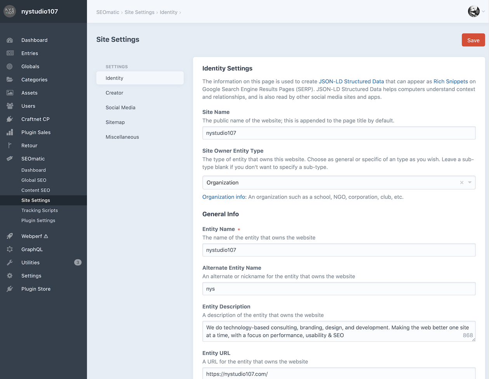
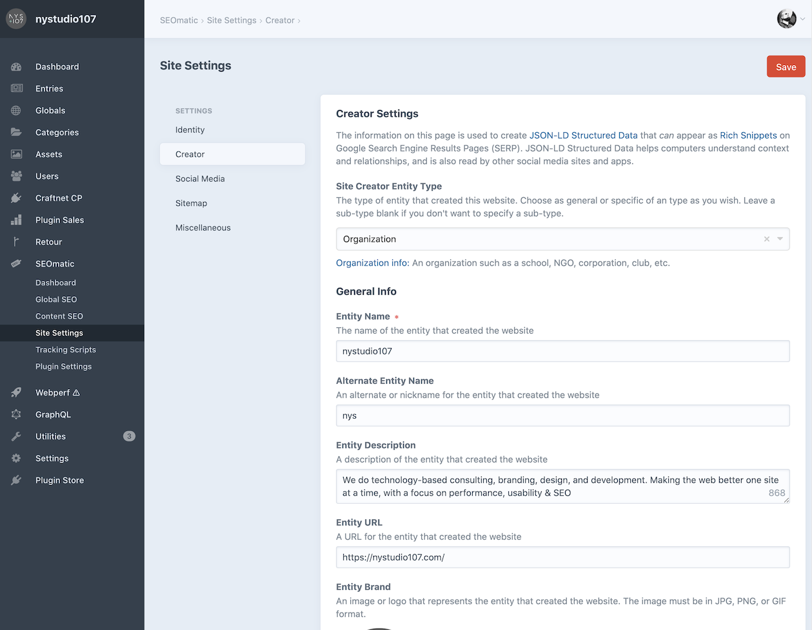
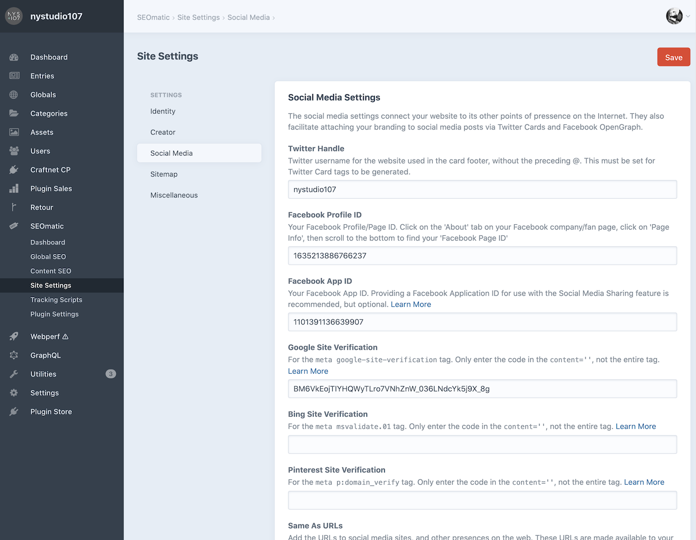
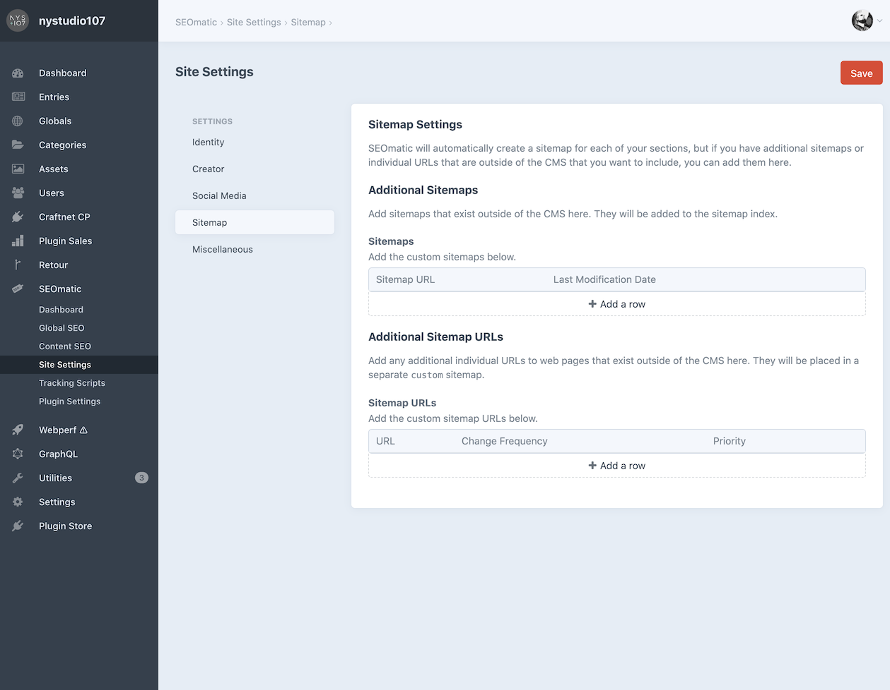
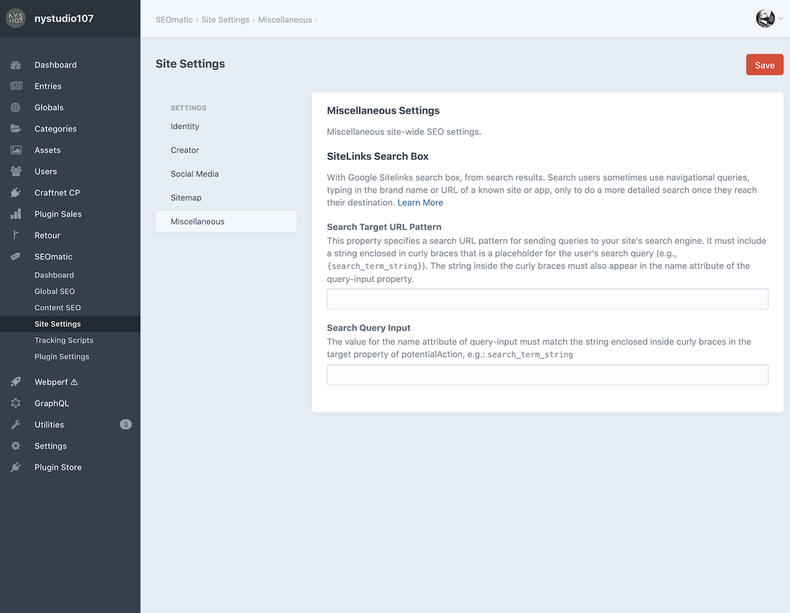

# Site Settings

Site Settings are broadly used to identify the site’s creator and establish links for search engines and external services.

## Identity Settings

These settings are used to globally define the identity and ownership of the site.

They’re combined with the SEO Template Meta settings to generate [JSON-LD](https://developers.google.com/schemas/formats/json-ld?hl=en) microdata.

The Site Owner type determines the JSON-LD schema that will be used to identity the site to search engines.

Leave any fields blank that aren’t applicable or which you do not want as part of the SEO schema.

## Creator Settings

These settings are used to globally define the _creator_ of the site, such as an agency or freelancer.

They’re combined with the SEO Template Meta settings to generate [JSON-LD](https://developers.google.com/schemas/formats/json-ld?hl=en) microdata and the `humans.txt` file.

The Site Creator type determines the JSON-LD schema that will be used to identity the site to search engines.

Leave any fields blank that aren’t applicable or which you do not want as part of the SEO schema.

## Social Media Settings

The social media settings connect your site to its other points of pressence on the internet. They also facilitate attaching your branding to social media posts via Twitter Cards and Facebook Open Graph.

## Sitemap Settings

SEOmatic will automatically create a sitemap for each of your sections, but if you have additional sitemaps or individual URLs that are outside of the CMS that you want to include, you can add them here.

## Miscellaneous Settings

Miscellaneous site-wide SEO settings.
