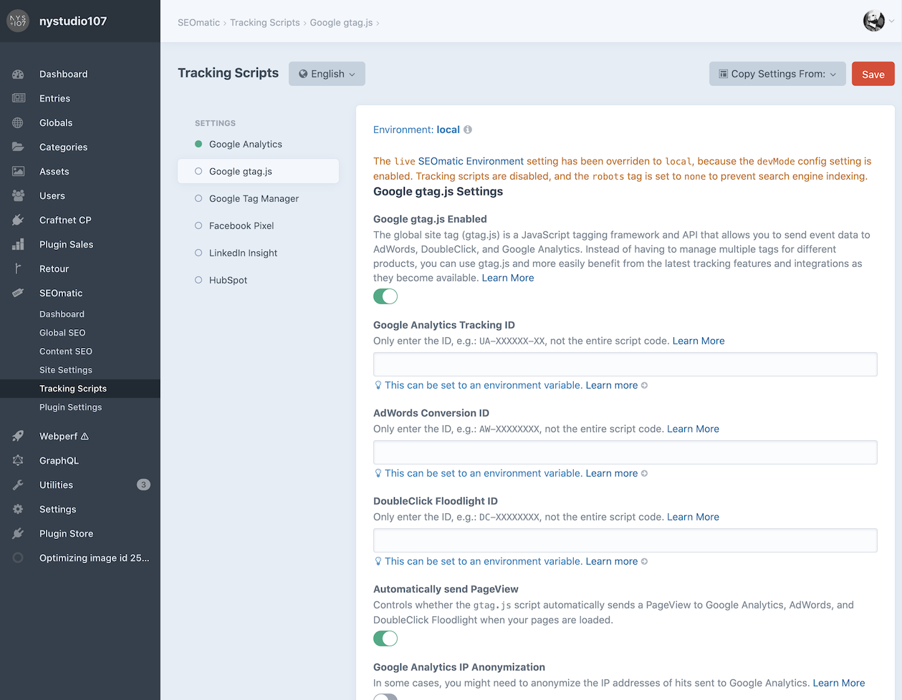
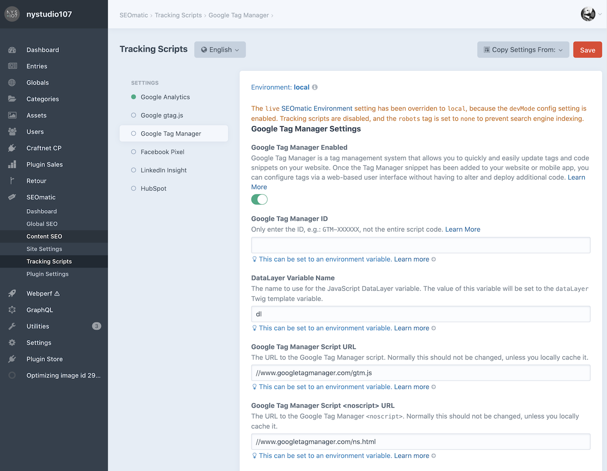
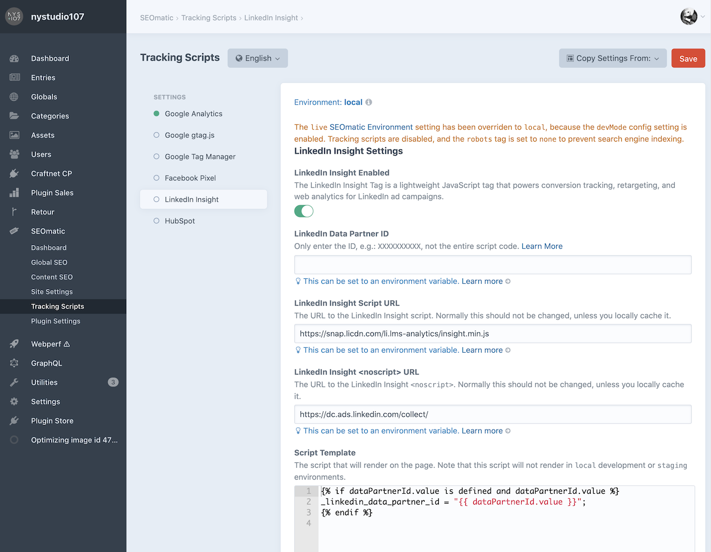
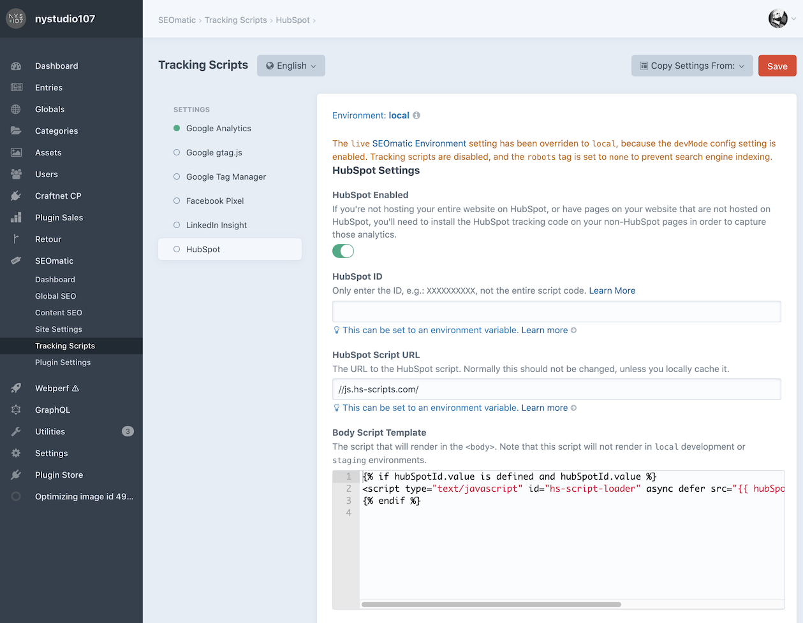

# Tracking Scripts

SEOmatic supports setting up common tracking scripts from the control panel.

These are included on front-end pages when the SEOmatic environment is set to `live` production. If `devMode` is enabled, the SEOmatic environment is automatically set to `local` development.

## Google Analytics Settings


Google Analytics gives you the digital analytics tools you need to analyze data from all touchpoints in one place, for a deeper understanding of the customer experience. You can then share the insights that matter with your whole organization. [Learn More](https://www.google.com/analytics/analytics/#?modal_active=none)

If you’d like to include the Google Analytics script even when `devMode` is enabled, you can add this line to a template:

```twig

```

## Google `gtag.js` Settings



The [global site tag (gtag.js)](https://developers.google.com/gtagjs/) is a JavaScript tagging framework and API that allows you to send event data to AdWords, DoubleClick, and Google Analytics. Instead of having to manage multiple tags for different products, you can use gtag.js and more easily benefit from the latest tracking features and integrations as they become available.

If you’d like to include the gtag.js script even when `devMode` is enabled, you can add this line to a template:

```twig

```

## Google Tag Manager Settings



[Google Tag Manager](https://support.google.com/tagmanager/answer/6102821?hl=en) is a tag management system that allows you to quickly and easily update tags and code snippets on your site. Once the Tag Manager snippet has been added to your site or mobile app, you can configure tags via Google’s web-based user interface without having to alter and deploy additional code.

You can set the `dataLayer` passed in to Google Tag Manager via Twig:

```twig

```

If you’d like to include the Google Tag Manager script even when `devMode` is enabled, you can add this line to a template:

```twig

```

## Facebook Pixel Settings


The [Facebook Pixel](https://www.facebook.com/business/help/651294705016616) is an analytics tool that helps you measure the effectiveness of your advertising. You can use the Facebook pixel to understand the actions people are taking on your site and reach audiences you care about.

If you’d like to include the Facebook Pixel script even when `devMode` is enabled, you can add this line to a template:

```twig

```

## LinkedIn Insight Settings



The LinkedIn Insight Tag is a lightweight JavaScript tag that powers conversion tracking, retargeting, and web analytics for LinkedIn ad campaigns.

If you’d like to include the LinkedIn Insight script even when `devMode` is enabled, you can add this line to a template:

```twig

```

## HubSpot Settings



If you’re not hosting your entire site on HubSpot, or have pages on your site that are not hosted on HubSpot, you’ll need to install the HubSpot tracking code on your non-HubSpot pages to capture those analytics.

If you’d like to include the HubSpot script even when `devMode` is enabled, you can add this line to a template:

```twig

```
