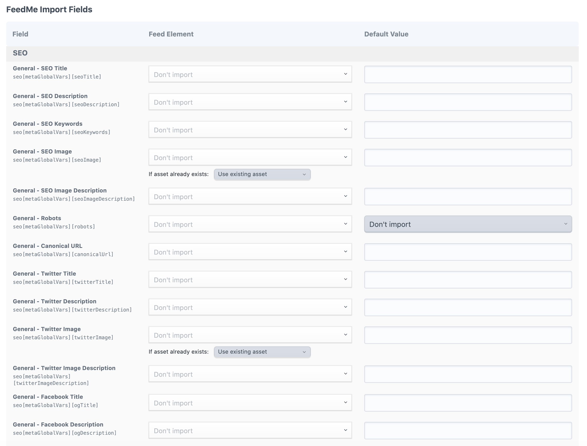

# Issues & Upgrading

Where to report issues and notes for upgrading from previous versions.

## Issues

Please report any issues you find to [SEOmatic Issues](https://github.com/nystudio107/craft-seomatic/issues) on GitHub.

## Upgrading from SEOmatic 1.x for Craft CMS 2.x

If you’re upgrading a site from Craft CMS 2.x to 5.x that used the older SEOmatic plugin, here’s what you need to know.

SEOmatic will migrate your old Craft 2.x Field settings & data in the following ways:

* The Content SEO settings for each Section where you had an old SEOmatic Meta FieldType will be migrated for you.
* If you add a new SEO Settings Field to a section that had an old SEOmatic Meta field in it, it will migrate any custom data you had entered on a per-Entry basis

::: warning
Keep your old Craft 2.x Seomatic_Meta fields intact; don’t delete them or change them to use the new SEO Settings field type. Instead, create a new SEO Settings field in the same Section, Category Group, or Commerce Product Type. It will automatically look for and migrate data from the old Seomatic_Meta Field.
:::

SEOmatic for Craft CMS 3 is a complete rewrite and re-architecture from scratch of the plugin. This allowed us to take what we learned from SEOmatic 1.x, and rebuild it with a much more robust and extendable architecture.

If feasible, we think the best way to update sites using SEOmatic is to start fresh, and explore how the conceptual changes in the plugin affect how you use it. In most cases, you don’t even need to use an SEOmatic Field, and the setup is cleaner and easier without it! We hope you love it!

::: tip Check Your Templates
The Twig templating syntax has changed. You may not need to use Twig at all with the new version, but consider giving the [Twig Templating](using/) docs a once-over.
:::

## Importing Data to SEOmatic

It is highly recommended that you set up mappings from existing content to your SEO via the **Content SEO** settings as described above. Usually this obviates the need to import data into SEOmatic, instead _pulling_ it from your content.

In addition to that, however, if you also have custom SEO data that you need to import, you can import that into an SEO Settings field using Pixel & Tonic’s [Feed Me plugin](https://plugins.craftcms.com/feed-me).

::: tip
The SEO Settings field is meant to be a custom override for your Content SEO Settings. In many cases, you won’t need or want an SEO Settings field at all.
:::

Once you have added an SEO Settings field added to a Section, it will show up as an import target in Feed Me:

See the [Feed Me documentation](https://docs.craftcms.com/feed-me/v4/) for more information on importing data into Craft CMS.
