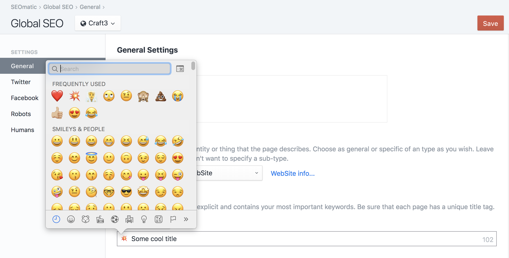

# SEOmatic Overview

SEOmatic allows you to quickly get a site running with a robust, comprehensive SEO strategy that follows [modern best practices](https://nystudio107.com/blog/modern-seo-snake-oil-vs-substance). It does this in a Craft-y way that’s flexible and customizable.

SEOmatic adds meta containers that are available to your templates much like Craft’s `entry` variables. Working with them should feel familiar and flexible.

Unlike Craft’s `entry` variables, the meta containers may use information that’s modified at different levels and expressed in different ways on the site.

SEOmatic manages caches behind the scenes to ensure all this information can be used effectively with a minimal impact on site performance.

## The Meta Cascade

SEOmatic cascades SEO data for any given route, by allowing three distinct places where content authors can add that data:

1. **Global SEO** – Site-wide base settings applied when there isn’t anything more specific.
2. **Content SEO** – Settings for each Craft _section_, like Entries, Categories, and Products. Sections and entry types can designate which fields SEOmatic should pull details from.
3. **SEO Settings Fields** – Entry-level customization via the included SEO Settings field type. Ideally this is only necessary for tailoring when _Content SEO_ configuration designates useful defaults.

These SEO settings layer on top of each other, so the most specific value provided is always what is used for a given page. Content SEO settings override Global SEO settings, and SEO Settings fields override them both.

If any SEO setting value is left **empty**, it will fall back on existing SEO settings data. For example, if you have no SEO Image specified in your Content SEO settings for a given Section, it will fall back on the Global SEO Image.

In this way, the SEO data that SEOmatic provides _cascades_ together to form the final SEO meta data for a given page.

## Twig Overrides

You can work with and further manipulate the SEO information from that cascade using robust Twig and PHP APIs, for complete control over the SEO meta data that is rendered for your website.

See [Using SEOmatic](./using/) for an in-depth look at how SEOmatic works under the hood, and for reference on the Twig APIs.

## Plugin Support

SEOmatic automatically works with the following plugins:

* [Craft Commerce](https://plugins.craftcms.com/commerce) from Pixel & Tonic
* [Digital Products](https://plugins.craftcms.com/digital-products) from Pixel & Tonic
* [Calendar](https://plugins.craftcms.com/calendar) from Solspace
* [Campaign](https://plugins.craftcms.com/campaign) from Put Your Lights On

This means that SEOmatic will treat the Elements that these plugins provide as first class citizens, just like Craft Entries & Categories.

SEOmatic will generate metadata, sitemaps, and have a Craft CP UI for them. If you have a custom Element provided by a plugin or module, you can integrate it using the [SeoElementInterface](https://github.com/nystudio107/craft-seomatic/blob/v4/src/base/SeoElementInterface.php).

## Emoji Support

SEOmatic supports using Emojis in any of the fields in SEOmatic, so you could use one in the SEO Description, for instance:

It’s up to Google whether or not to display the emojis that you add to your SEO meta, but used effectively, they can help make your entries in the SERP stand out from others. Learn more: [Why Use Emojis in Your SEO / PPC Strategy?](https://www.jellyfish.net/en-us/news-and-views/why-use-emojis-in-your-seo-ppc-strategy)

On the Mac, you can invoke an Emoji keyboard inside of any text field by hitting Command Control Space. This works in any Mac application, not just web browsers or SEOmatic.

## Single Page App (SPA) Support

SEOmatic fully supports working with SPAs, allowing you to receive the metadata needed for a given route either as an array, or as DOM elements ready to be inserted.

See the [Headless SPA API](advanced.md#headless-spa-api) section for details.
